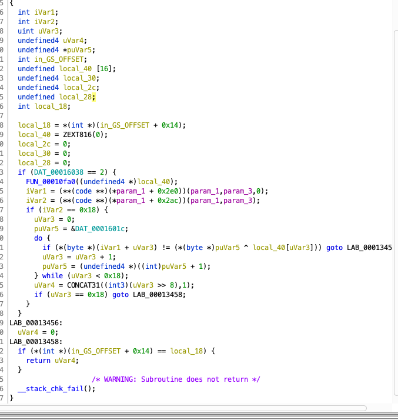
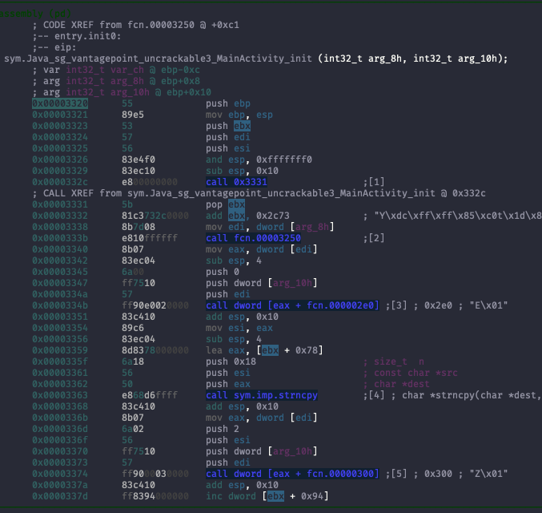
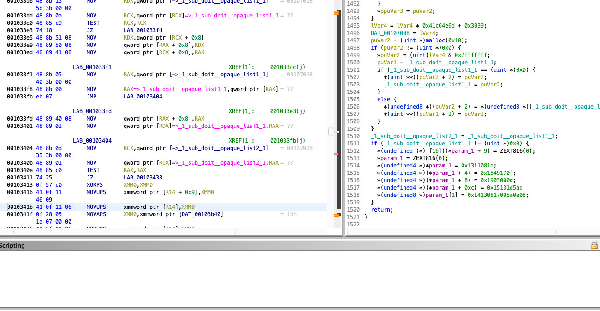

# UnCrackable 3

As the challenge "UnCrackable 2" we need to bypass the Root controll, as before
we use apktool to unpack and read the smali of the app:

```bash
apktool d UnCrackable-Level3.apk -o UnCrackable-Level3
```

Then to read the code in a confortable way we can use
[jadx](https://github.com/skylot/jadx) and read the content of the apk:

```bash
jadx-gui UnCrackable-Level3.apk
```

As the other challenges there are some controll on presence of rooting device,
this time to baypass it we can change the onClick implementation of the dialog.
The file `UnCrackable-Level3/smali/sg/vantagepoint/uncrackable3/MainActivity$1.smali`

```smali
...
# virtual methods
.method public onClick(Landroid/content/DialogInterface;I)V
    .locals 0

    const/4 p1, 0x0

    .line 45
    #invoke-static {p1}, Ljava/lang/System;->exit(I)V

    return-void
.end method
```

Now we need to read the code of the CodeCheck function, it call as in the
previeus challenge a native function and as before we use radare2 or in my case
ghidra to have a more easy to read code.

For this part i decided to read the libfoo.so compiled for the x86.
We see that there is a controll on the length of the input need to be of 24 char.
than there is a cycle through all the char and do a compare between the input
and the xor between a variable saved on a specific location and the result of
function.



Reading the code of the application with jadx-gui we can read in the
MainActivity that a variable called `xorkey` that contains a string of 24 char
is passed to a native function named init.

This function save the content of the parameter to a location in memory that is
the same of the CodeCheck function.



Now we need the content of the return of the function in the CodeCheck
function. In my case this function is called `FUN_00010fa0`. This is a very long
function, but we know that the result is saved in the variable that is passed as
pointer, so at the end we find that key, it is divided in 2 part the first is
loaded from a index and the other is moved.



Now to get the flag we just need to do the xor between the two key:

```text
import codecs
xorkey = "pizzapizzapizzapizzapizz"
key_FUN_00010fa0 = codecs.decode('1d0811130f1749150d0003195a1d1315080e5a0017081314','hex').decode('ascii')

print("FLAG: " + "".join(chr(ord(x) ^ ord(y)) for x, y in zip(key_FUN_00010fa0, xorkey)))
```

```text
FLAG: making owasp great again
```
